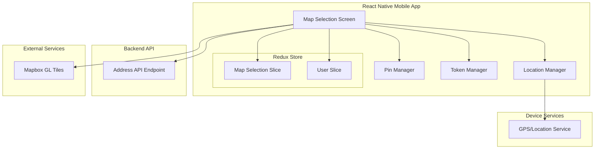

# Design Document: Address Map Selection Feature

## Overview

This design document specifies the technical architecture for a simple map-based address selection feature in the React Native food delivery application. The feature enables users to select their delivery address by tapping on an interactive map to drop a pin, viewing the selected coordinates, and saving them to their user profile. This provides an intuitive alternative to manual address entry.

### Key Capabilities

- **GPS Location Detection**: Utilizes device GPS through Expo Location API to center the map on the user's current location
- **Interactive Map Display**: Renders an interactive Mapbox GL map with pan and zoom gestures
- **Pin Placement**: Allows users to tap anywhere on the map to drop a pin marker
- **Coordinate Display**: Shows the latitude and longitude of the selected pin location
- **Profile Integration**: Saves selected coordinates to the user's profile via backend API
- **Secure Token Management**: Manages Mapbox API credentials through environment variables

### Technology Stack

- **Mapping Library**: `@rnmapbox/maps` (React Native Mapbox GL SDK) - already installed
- **Location Services**: `expo-location` - already installed
- **HTTP Client**: `axios` (existing API service)
- **State Management**: Redux Toolkit (existing store architecture)
- **Navigation**: React Navigation (existing navigation structure)

### Scope Limitations

This is a **minimal implementation** focused on core functionality:
- ✅ Pin placement by tap
- ✅ Coordinate display
- ✅ Save coordinates to profile
- ❌ No reverse geocoding (no address text from coordinates)
- ❌ No address preview or validation
- ❌ No route calculation or ETA
- ❌ No multiple address management (single location save)

## Architecture

### System Architecture Diagram



### Component Hierarchy

```
MapSelectionScreen
├── MapView (Mapbox GL)
│   └── PinMarker (conditional)
├── CoordinateDisplay
├── SaveButton
└── ErrorMessage (conditional)
```

## Components and Interfaces

### 1. MapSelectionScreen Component

**Responsibility**: Main screen component that orchestrates map display, pin placement, and coordinate saving.

**Props**:
```typescript
interface MapSelectionScreenProps {
  navigation: NavigationProp<any>;
}
```

**State** (via Redux):
```typescript
interface MapSelectionState {
  userLocation: Coordinates | null;
  selectedLocation: Coordinates | null;
  isLoading: boolean;
  error: string | null;
  isSaving: boolean;
  saveSuccess: boolean;
}

interface Coordinates {
  latitude: number;
  longitude: number;
}
```

**Key Methods**:
- `handleMapPress(coordinates: Coordinates)`: Captures tap coordinates and updates pin location
- `handleSaveLocation()`: Sends selected coordinates to backend API
- `requestLocationPermission()`: Requests GPS permissions on mount
- `centerOnUserLocation()`: Centers map on user's current GPS location

### 2. Location Manager

**Responsibility**: Handles GPS location detection and permission management.

**Interface**:
```typescript
interface LocationManager {
  requestPermissions(): Promise<PermissionStatus>;
  getCurrentLocation(): Promise<Coordinates | null>;
  hasLocationPermission(): Promise<boolean>;
}

enum PermissionStatus {
  GRANTED = 'granted',
  DENIED = 'denied',
  UNDETERMINED = 'undetermined'
}
```

**Implementation Details**:
- Uses `expo-location` library
- Requests `FOREGROUND` location permission
- Sets accuracy to `Location.Accuracy.Balanced` for reasonable precision without excessive battery drain
- Implements 10-second timeout for location requests
- Returns null on timeout or error

### 3. Pin Manager

**Responsibility**: Manages pin marker placement and coordinate capture.

**Interface**:
```typescript
interface PinManager {
  placePin(coordinates: Coordinates): void;
  removePin(): void;
  getSelectedLocation(): Coordinates | null;
}
```

**Implementation Details**:
- Maintains single pin state (removes previous pin when new one is placed)
- Stores coordinates with full precision (no rounding until display)
- Uses Mapbox `PointAnnotation` component for pin marker
- Custom pin icon (red marker) for visual distinction

### 4. Token Manager

**Responsibility**: Securely manages Mapbox API token.

**Interface**:
```typescript
interface TokenManager {
  getMapboxToken(): string;
  validateToken(): boolean;
}
```

**Implementation Details**:
- Reads token from environment variable `EXPO_PUBLIC_MAPBOX_TOKEN`
- Throws error if token is missing or empty
- Token stored in `.env` file (excluded from version control)
- No token validation against Mapbox API (fails gracefully if invalid)

### 5. Redux Map Selection Slice

**Responsibility**: Manages global state for map selection feature.

**State Shape**:
```typescript
interface MapSelectionState {
  userLocation: Coordinates | null;
  selectedLocation: Coordinates | null;
  isLoading: boolean;
  error: string | null;
  isSaving: boolean;
  saveSuccess: boolean;
}
```

**Actions**:
- `setUserLocation(coordinates: Coordinates)`: Updates user's current GPS location
- `setSelectedLocation(coordinates: Coordinates)`: Updates selected pin location
- `clearSelectedLocation()`: Removes pin and clears selected coordinates
- `setLoading(isLoading: boolean)`: Updates loading state
- `setError(error: string | null)`: Sets error message
- `setSaving(isSaving: boolean)`: Updates saving state
- `setSaveSuccess(success: boolean)`: Updates save success state
- `resetState()`: Resets all state to initial values

**Async Thunks**:
- `saveLocationToProfile(coordinates: Coordinates)`: Sends POST request to backend API

### 6. Backend API Integration

**Endpoint**: `POST /api/users/address`

**Request**:
```typescript
interface SaveAddressRequest {
  latitude: number;
  longitude: number;
}

// Headers
{
  'Authorization': 'Bearer <user_token>',
  'Content-Type': 'application/json'
}
```

**Response**:
```typescript
// Success (200)
interface SaveAddressResponse {
  success: boolean;
  message: string;
  address: {
    latitude: number;
    longitude: number;
  };
}

// Error (4xx, 5xx)
interface ErrorResponse {
  error: string;
  message: string;
}
```

## Data Models

### Coordinates Model

```typescript
interface Coordinates {
  latitude: number;   // Range: -90 to 90
  longitude: number;  // Range: -180 to 180
}
```

**Validation Rules**:
- Latitude must be between -90 and 90 (inclusive)
- Longitude must be between -180 and 180 (inclusive)
- Both values must be valid numbers (not NaN or Infinity)

**Display Format**:
- Latitude: formatted to 6 decimal places (e.g., "37.774929")
- Longitude: formatted to 6 decimal places (e.g., "-122.419418")
- Precision: ~0.11 meters at the equator

### Map Configuration Model

```typescript
interface MapConfig {
  initialZoom: number;        // Default: 15
  minZoom: number;            // Default: 10
  maxZoom: number;            // Default: 20
  centerCoordinate: Coordinates;
  styleURL: string;           // Mapbox style URL
}
```

**Default Values**:
- Initial zoom: 15 (neighborhood level)
- Min zoom: 10 (city level)
- Max zoom: 20 (building level)
- Style: `mapbox://styles/mapbox/streets-v12` (standard street map)

## Error Handling

### GPS Permission Errors

**Error**: User denies location permission
- **Message**: "Location permission is required to use the map"
- **Action**: Display message, show map with default center (user can still pan manually)
- **Recovery**: Provide link to app settings to enable permissions

**Error**: GPS signal unavailable
- **Message**: "Unable to determine your location. Please check your GPS settings"
- **Action**: Display message, show map with default center
- **Recovery**: User can manually pan to their location

**Error**: GPS timeout (>10 seconds)
- **Message**: "Location request timed out. Please try again"
- **Action**: Display message, show map with default center
- **Recovery**: Provide retry button to request location again

### API Errors

**Error**: Network unavailable
- **Message**: "No internet connection. Please check your network"
- **Action**: Disable save button, display error message
- **Recovery**: Automatically retry when network is restored

**Error**: API request timeout (>30 seconds)
- **Message**: "Request timed out. Please check your connection"
- **Action**: Display error message, keep pin on map
- **Recovery**: Provide retry button

**Error**: API returns 4xx error
- **Message**: "Failed to save location. Please try again"
- **Action**: Display error message, keep pin on map
- **Recovery**: Provide retry button

**Error**: API returns 5xx error
- **Message**: "Server error. Please try again later"
- **Action**: Display error message, keep pin on map
- **Recovery**: Provide retry button

### Mapbox Token Errors

**Error**: Token missing from environment
- **Message**: "Map configuration error. Please contact support"
- **Action**: Display error screen, prevent map rendering
- **Recovery**: Developer must add token to `.env` file

**Error**: Invalid token (map fails to load)
- **Message**: "Unable to load map. Please try again later"
- **Action**: Display error message
- **Recovery**: Developer must verify token validity

## Testing Strategy

### Unit Tests

Unit tests will verify specific behaviors and edge cases for individual components and utilities.

**Location Manager Tests**:
- ✅ Returns coordinates when GPS is available
- ✅ Returns null when GPS times out
- ✅ Returns null when permissions are denied
- ✅ Handles expo-location errors gracefully
- ✅ Validates coordinate ranges (latitude: -90 to 90, longitude: -180 to 180)

**Pin Manager Tests**:
- ✅ Places pin at tapped coordinates
- ✅ Removes previous pin when new pin is placed
- ✅ Returns null when no pin is placed
- ✅ Stores coordinates with full precision

**Coordinate Formatting Tests**:
- ✅ Formats latitude to 6 decimal places
- ✅ Formats longitude to 6 decimal places
- ✅ Handles edge cases (0, negative values, max/min values)
- ✅ Handles invalid inputs (NaN, Infinity, undefined)

**Token Manager Tests**:
- ✅ Returns token from environment variable
- ✅ Throws error when token is missing
- ✅ Throws error when token is empty string

**Redux Slice Tests**:
- ✅ Sets user location correctly
- ✅ Sets selected location correctly
- ✅ Clears selected location
- ✅ Updates loading state
- ✅ Updates error state
- ✅ Resets state to initial values
- ✅ Disables save button when no pin is placed
- ✅ Enables save button when pin is placed

### Integration Tests

Integration tests will verify interactions between components and external services.

**GPS Integration Tests**:
- ✅ Requests location permission on screen mount
- ✅ Centers map on user location when permission granted
- ✅ Shows default center when permission denied
- ✅ Displays appropriate error messages for GPS failures

**Map Interaction Tests**:
- ✅ Captures tap coordinates correctly
- ✅ Places pin marker at tapped location
- ✅ Updates coordinate display when pin is placed
- ✅ Removes previous pin when new tap occurs

**API Integration Tests**:
- ✅ Sends correct request format to backend
- ✅ Includes authentication token in headers
- ✅ Handles successful save response
- ✅ Handles API error responses
- ✅ Handles network timeout
- ✅ Retries on failure when user taps retry button

**Navigation Integration Tests**:
- ✅ Navigates to map screen from address management
- ✅ Navigates back to address management after successful save
- ✅ Provides back button to return without saving

### Manual Testing Checklist

**GPS Scenarios**:
- [ ] Test with location permission granted
- [ ] Test with location permission denied
- [ ] Test with GPS disabled
- [ ] Test in airplane mode
- [ ] Test with weak GPS signal (indoors)

**Map Interaction Scenarios**:
- [ ] Test pin placement on various map locations
- [ ] Test pan gesture
- [ ] Test zoom gesture (pinch)
- [ ] Test rapid tapping (should only show one pin)
- [ ] Test tapping on map edges

**Save Scenarios**:
- [ ] Test save with valid coordinates
- [ ] Test save without network connection
- [ ] Test save with invalid auth token
- [ ] Test save button disabled state (no pin)
- [ ] Test save button enabled state (pin placed)
- [ ] Test retry after failure

**UI/UX Scenarios**:
- [ ] Verify coordinate display updates immediately
- [ ] Verify error messages are clear and helpful
- [ ] Verify loading states during GPS and API calls
- [ ] Verify success message after save
- [ ] Verify navigation flow (to/from address management)

### Test Configuration

**Test Framework**: Jest + React Native Testing Library
**Coverage Target**: 80% code coverage for business logic
**Mock Strategy**:
- Mock `expo-location` for GPS tests
- Mock `axios` for API tests
- Mock `@rnmapbox/maps` for map component tests
- Use Redux mock store for state management tests

## Implementation Notes

### File Structure

```
mobile-app/src/
├── screens/
│   └── MapSelectionScreen.tsx          # Main screen component
├── components/
│   ├── map/
│   │   ├── MapView.tsx                 # Mapbox GL wrapper
│   │   └── PinMarker.tsx               # Pin marker component
│   └── CoordinateDisplay.tsx           # Coordinate display component
├── services/
│   ├── locationService.ts              # Location Manager
│   └── tokenService.ts                 # Token Manager
├── store/
│   └── slices/
│       └── mapSelectionSlice.ts        # Redux slice
├── utils/
│   └── coordinateUtils.ts              # Coordinate formatting utilities
└── types/
    └── map.types.ts                    # TypeScript interfaces
```

### Dependencies

**Already Installed**:
- `@rnmapbox/maps`: ^10.0.0
- `expo-location`: ^16.0.0
- `axios`: ^1.6.0
- `@reduxjs/toolkit`: ^2.0.0
- `react-navigation`: ^6.0.0

**No New Dependencies Required**

### Environment Configuration

**Required Environment Variables**:
```bash
# .env file
EXPO_PUBLIC_MAPBOX_TOKEN=pk.your_mapbox_token_here
EXPO_PUBLIC_API_BASE_URL=http://your-backend-url
```

**Setup Instructions**:
1. Create `.env` file in `mobile-app/` directory
2. Add Mapbox token (obtain from Mapbox dashboard)
3. Ensure `.env` is in `.gitignore`
4. Restart Metro bundler after adding environment variables

### Performance Considerations

**Map Rendering**:
- Use `onDidFinishLoadingMap` callback to show UI only after map is ready
- Avoid re-rendering map component unnecessarily (use `React.memo`)

**GPS Requests**:
- Request location only once on screen mount
- Implement 10-second timeout to prevent indefinite waiting
- Cache user location in Redux to avoid repeated GPS requests

**API Calls**:
- Debounce save button to prevent duplicate requests
- Show loading indicator during API calls
- Implement request timeout (30 seconds)

### Accessibility

**Screen Reader Support**:
- Add `accessibilityLabel` to map component: "Interactive map for selecting delivery address"
- Add `accessibilityLabel` to save button: "Save selected location"
- Add `accessibilityHint` to map: "Tap anywhere on the map to drop a pin"

**Keyboard Navigation**:
- Not applicable (touch-based interaction)

**Color Contrast**:
- Ensure pin marker has sufficient contrast against map background
- Use high-contrast colors for error messages (red text on white background)

### Security Considerations

**Token Security**:
- Never commit `.env` file to version control
- Use `EXPO_PUBLIC_` prefix for client-side environment variables
- Rotate Mapbox token if accidentally exposed

**API Security**:
- Include authentication token in all API requests
- Validate coordinates on backend before saving
- Implement rate limiting on backend to prevent abuse

**Data Privacy**:
- Request only necessary location permissions (foreground only)
- Do not store GPS coordinates locally (only in backend)
- Clear selected location from Redux when user navigates away

## Future Enhancements

**Out of Scope for Initial Implementation**:
- Reverse geocoding (converting coordinates to human-readable address)
- Address preview before saving
- Multiple address management (save multiple locations)
- Address search functionality
- Route calculation from current location to selected address
- Favorite locations / saved places
- Address validation against delivery zones

These features may be added in future iterations based on user feedback and business requirements.
